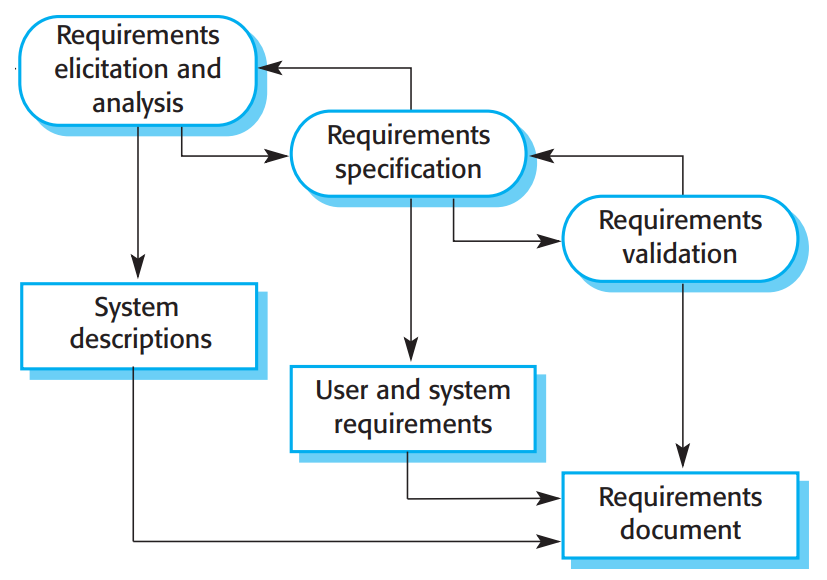
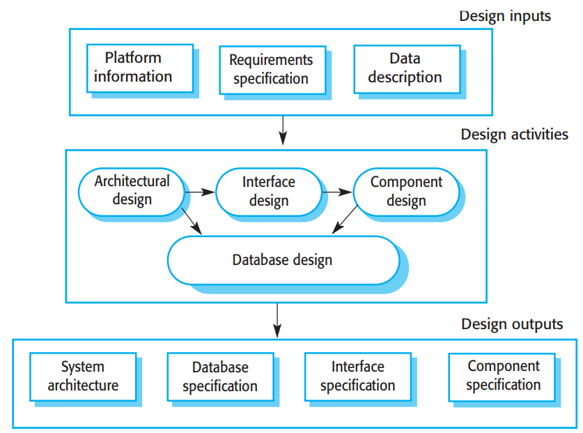
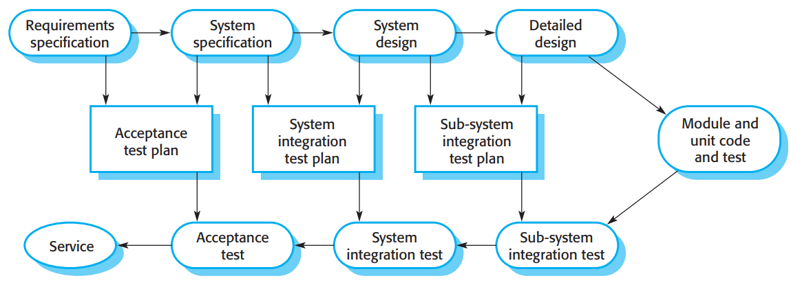
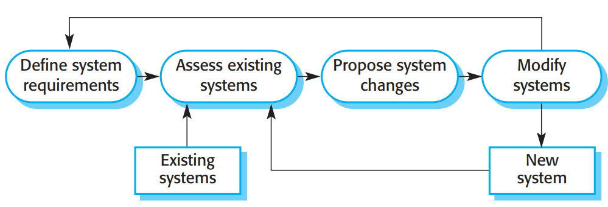
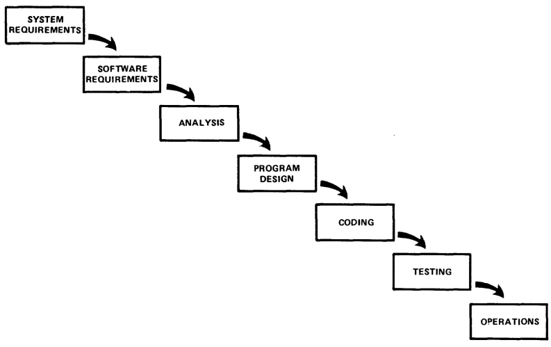
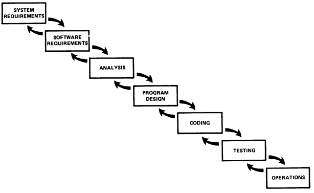
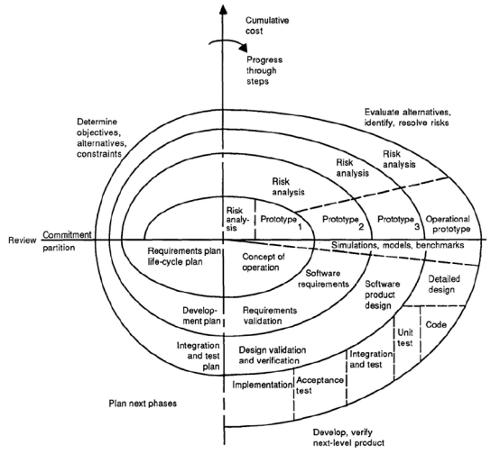
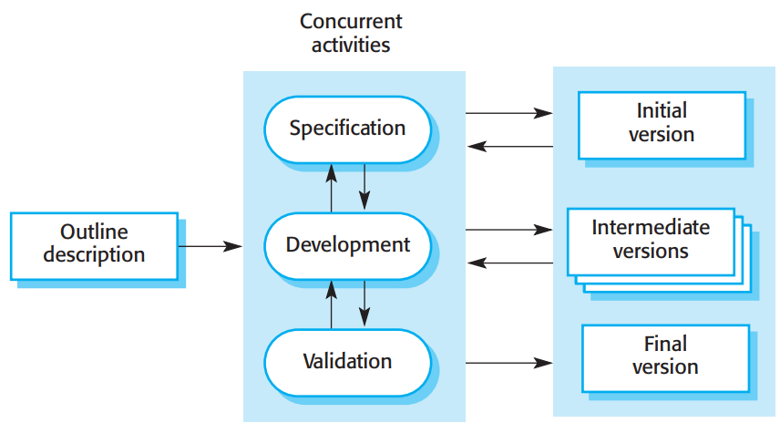
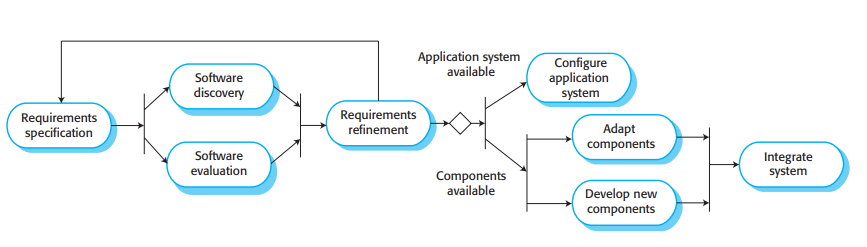
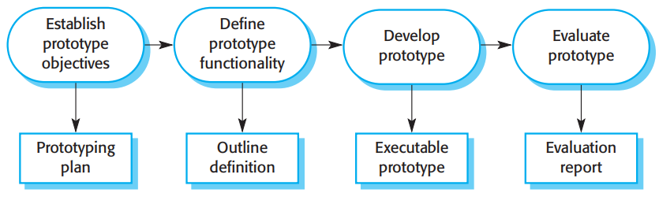

# Engenharia de Software - 2021/2022

# Índice

**[Índice](#índice)**

**[1. Software Processes](#software-processes)**

> [Software Engineering](#software-engineering) 
>
> [Software process](#software-process) 
>
> [Software development life cycle](#software-development-life-cycle) 
>
> [Reason to defined processes](#reason-to-defined-processes) 
>
> [Process Activities](#process-activities) 
>
> [Requirements engineering](#requirements-engineering) 
>
> [Software design and implementation](#software-design-and-implementation) 
>
> [Software Verification & Validation](#software-verification-validation) 
>
> [Testing phases in plan-driven software process (V-model)](#testing-phases-in-plan-driven-software-process-v-model) 
>
> [Software evolution (or maintenance)](#software-evolution-or-maintenance) 
>
> [System evolution](#system-evolution) 
>
> [Software Process Models](#software-process-models) 
>
> [Waterfall model](#waterfall-model) 
>
> [Incremental](#incremental) 
>
> [Spiral](#spiral) 
>
> [Incremental development (& delivery)](#incremental-development-delivery) 
>
> [Benefits](#benefits) 
>
> [Problems](#problems) 
>
> [Integration and configuration](#integration-and-configuration) 
>
> [Advantages](#advantages) 
>
> [Disadvantages](#disadvantages) 
>
> [Software prototyping](#software-prototyping) 
>
> [Key Points](#key-points) 

**[2. Rational Unified Process (RUP)](#rational-unified-process-rup)**

**[3. Extreme Programming](#extreme-programming)**

**[4. Requirements Engineering](#requirements-engineering-1)**

**[5. Use Case and Domain Modeling with UML](#use-case-and-domain-modeling-with-uml)**

**[6. Software Architecture & Design](#software-architecture-design)**

**[7. Software Project Management](#software-project-management)**

**[8. Software Verification and Validation (V&V)](#software-verification-and-validation-vv)**

**[9. Software Construction and Evolution](#software-construction-and-evolution)**

**[10. Using JSON Web APIs in Dart](#using-json-web-apis-in-dart)**

**[11. Introduction to behavior modeling in UML](#introduction-to-behavior-modeling-in-uml)**

**[12. Scrum](#scrum)**

# **1. Software Processes**

## **Software Engineering**

**Process:**

-   Application of engineering to software;

-   Application of a **systematic, disciplined and quantifiable approach
    > to the development, operation and maintenance of software**.

**Performance measures:**

-   Software Engineering gives importance to the **development of a
    > high-quality software based on the cost-effect and time, in a
    > predictable way**, for large scale systems.

## **Software process**

-   Structured **set of activities** to develop a software system

-   **Process activities**:

    -   **Specification** - defining what the system should do;

    -   **Design and implementation** - defining the organization of the system and implementing the system;

    -   **Validation** - checking that it does what the customer wants;

    -   **Evolution** - changing the system in response to changing customer needs.

## **Software development life cycle**

1.  **Planning**

2.  **Analysis**

3.  **Design**

4.  **Implementation**

5.  **Testing & Integration**

6.  **Maintenance**

## **Reason to defined processes**

-   **Efficiency**

    -   incorporates best practices

    -   structures and guides your work

    -   keeps you focused on what need to be done now

-   **Consistency**

    -   result likely to be similar

    -   work likely to become predictable

-   **Basis for improvement**

    -   gathering data on your work helps determine which steps are the most time consuming, ineffective, or troublesome

    -   this is useful to determine opportunities for improvement

**Plan-driven and agile Processes**

-   **Plan-driven process -** all of the process activities are planned in advance and progress is measured against this plan.

-   **Agile process -** planning is incremental and it is easier to change the process to reflect changing customer requirements

-   Most practical processes include elements of both plan-driven and agile approaches

-   There are no right or wrong software processes

## **Process Activities**

### **Requirements engineering**

{width="3.3177088801399823in"
height="2.3015518372703414in"}

### **Software design and implementation**

{width="3.7103674540682414in"
height="2.755965660542432in"}

### **Software Verification & Validation**

-   Verification and validation (V & V) is intended to show that

    -   the system [conforms to its specification]{.ul} **(verification)**

    -   meets the [requirements and customer need]{.ul} **(validation)**

-   Performed mainly through testing, reviews & inspections

-   **Testing levels**:

    -   **Unit (or component) testing**

        -   Individual components are tested usually by their developers

    -   **Integration testing**

        -   Performed as components are integrated, to find integration
            > problems

    -   **System testing**

        -   The system as a whole is tested usually by an independent
            > test team, with a focus on emergent (performance,
            > usability, etc.)

    -   **Acceptance testing**

        -   The system is tested (under the customer responsibility)
            > with customer data to check that customer's needs are met.

### **Testing phases in plan-driven software process (V-model)**

{width="5.852171916010499in"
height="2.128946850393701in"}

### **Software evolution (or maintenance)**

-   Software is inherently flexible and can change

-   As requirements change through changing business, the software must
    > also evolve and change

-   Less and less systems are completely new

-   **Maintenance activities:**

    -   **Corrective** - bug fixing

    -   **Adaptive** - adapt to new platforms, technologies

    -   **Perfective** - new functionalities

### **System evolution**

{width="4.815682414698163in"
height="1.6398917322834645in"}

## **Software Process Models**

-   **Waterfall model**

    -   Plan-driven model

    -   Separate and distinct phases of specification and development

-   **Incremental development**

    -   Specification, development and validation are interleaved

    -   May be plan-driven or agile

-   **Integration and configuration**

    -   The system is assembled from existing configurable components.

    -   May be plan-drived or agile

-   **Software prototyping**

    -   Not actually a model but and approach to cope with uncertainty

### **Waterfall model**

{width="4.53378937007874in"
height="2.853755468066492in"}

-   Plan-driven model

-   Separate and distinct phases of specification and development

-   A phase has to be complete before moving to next phase

-   Inflexible division of project stages makes difficult to respond to
    > changing customer requirements

    -   Only used when requirements are well-understood and changes will
        > be limited in the design process

-   Mostly used for large systems engineering projects (system developed
    > at several sites)

    -   Plan-driven nature of the waterfall model helps coordinate the
        > work

### **Incremental**

{width="4.329705818022747in"
height="2.6497801837270343in"}

### **Spiral**

{width="5.432292213473316in"
height="5.034806430446194in"}

### **Incremental development (& delivery)**

-   System is developed in increments

-   Each increment is evaluated before the development of the next increment

-   Specification, development and validation may be interleaved

-   Plan-driven or agile

{width="4.646772747156605in"
height="2.5240780839895014in"}

#### Benefits

-   Cost of changing customer requirements is reduced

    -   Less documentation to change

    -   Unstable requirements can be left for later stages of development

-   More frequent and early customer feedback reduces risk of failure

-   Customer value can be delivered with each increment, so system functionality is available earlier

-   Early increments act as a prototype to discover new requirements for later increments

#### Problems

-   System structure degrades as new increments are added

    -   Regular changes corrupts its structure and making further changes becomes difficult and costly, unless time and money is spent on refactoring

-   Level of reuse may be suboptimal

    -   Hard to identify common facilities needed by all increments

-   Incremental delivery may not be possible for replacement systems

    -   Increments have less functionality than the system being replaced

-   Not adequate for establishing a development contract at the beginning

    -   Because of the nature of incremental development of the specification together with the software

### **Integration and configuration**

{width="6.057292213473316in"
height="1.7306550743657043in"}

#### Advantages

-   Reduced cost and risks as less software is developed from scratch

-   Faster delivery and development if system

#### Disadvantages

-   Requirements compromises are inevitable so system may not meet real needs of users

-   Loss of control over evolution of reused system elements

### **Software prototyping**

{width="4.993509405074366in"
height="1.5511406386701663in"}

## **Key Points**

-   There are many different software processes but all involve the following technical activities: specification, design and implementation, validation and evolution

-   Generic ways of organizing the basic process activities are described by software process models.

-   Examples include the 'waterfall' model, incremental development, and integration and configuration.

-   Processes should be organized to better cope with change, by including prototyping activities, iterative development, etc.

# **2. Rational Unified Process (RUP)**

### **Key characteristics**

# **3. Extreme Programming**

[[Extreme Programming
(XP)]{.ul}](https://moodle.up.pt/pluginfile.php/163331/course/section/42855/5.%20MIEIC-ESOF-2020-21-XP.pdf)

# **4. Requirements Engineering** 

[**[Requirements
Engineering]{.ul}**](https://moodle.up.pt/pluginfile.php/163331/course/section/42856/6.%20L.EIC-ES-2021-22-Requirements%20Engineering.pdf)

# **5. Use Case and Domain Modeling with UML**

[**[Use Case and Domain Modeling with
UML]{.ul}**](https://moodle.up.pt/pluginfile.php/163331/course/section/42856/7.%20L.EIC-ES-2021-22-Use%20Case%20and%20Domain%20Modeling%20with%20UML.pdf)

# **6. Software Architecture & Design**

[[Software architecture and
design]{.ul}](https://moodle.up.pt/pluginfile.php/163331/course/section/42858/9.%20LEIC-ESOF-2021-22-Architecture%20%20Design.pdf)

# **7. Software Project Management**

[[Software project
management.]{.ul}](https://moodle.up.pt/pluginfile.php/163331/course/section/42897/10.%20LEIC-ES-2021-22-ProjectManagement.pdf)

# **8. Software Verification and Validation (V&V)**

[[Software Verification and Validation
(V&V)]{.ul}](https://moodle.up.pt/pluginfile.php/163331/course/section/42898/11.%20L.EIC-ES-2021-22-Verification%20and%20Validation.pdf)

# **9. Software Construction and Evolution**

[[Software construction and
evolution]{.ul}](https://moodle.up.pt/pluginfile.php/163331/course/section/42900/12.%20LEIC-ES-2021-22-Construction-Evolution.pdf)

# **10. Using JSON Web APIs in Dart**

[[slides]{.ul}](https://moodle.up.pt/pluginfile.php/163331/course/section/42899/14.%20L.EIC-ES-2021-22-Using%20JSON%20Web%20APIs%20in%20Dart.pdf)

# **11. Introduction to behavior modeling in UML**

[[slides]{.ul}](https://moodle.up.pt/pluginfile.php/163331/course/section/42899/15.%20L.EIC-ES-2021-22-Introduction%20to%20Behavioral%20Modeling%20in%20UML.pdf)

# **12. Scrum**

[[slides]{.ul}](https://moodle.up.pt/pluginfile.php/163331/course/section/48648/16.%20L.EIC-ES-2021-22-Scrum.pdf)
